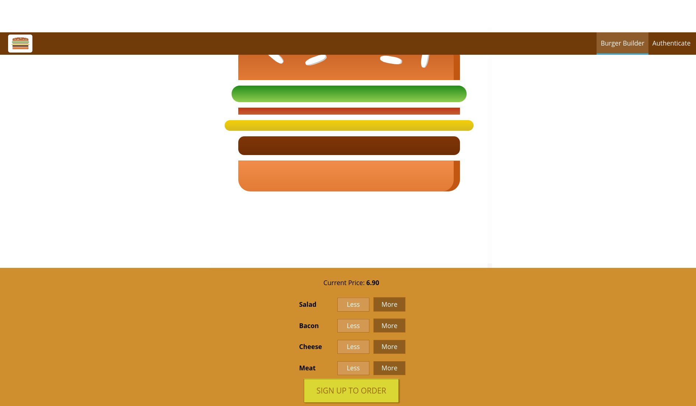

# A Yummy Burger App

## Purpose

Designed for consumer to be able customize their own desired burger for order after the consumer has registered an account. Consumer will be shown the final price and asked for additional information before the order is placed.

- Git clone the project, npm install, npm start, and go to client in terminal and npm start

*Please note that this project changed a lot throughout the entire course and some of the documentation may be off.

# Tools and Methods Used

* Routing 
* Authentication/Authorization
* Redux
* Validation
* Form Submission
* Asynchronous 
* Ect

